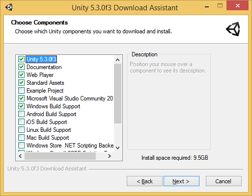

# Unity AR workshop
## Outline
In this workshop we're going to make a simple augmented reality (**AR**) application for your phone, to show the possiblities and applications of AR. We're going to use the game engine Unity, because it's cross-platform, easy to use and easy to set up for AR.

The goal of the workshop is to make an interactive AR experience. We'll go step by step through the content. if it goes too slow/fast for you: this is the document where you can skip ahead / fall back to.

## Learning outcomes
At the end of this workshop, you will be familiar with:
- The Unity engine
	- Creating a scene with objects
	- Basics of the engine and it's possibilities
	- Writing simple scripts
	- Building an application for an (android) phone
- The Vuforia AR plugin
	 - General setup in Unity
	 - It's possibilities

## Pre-requisites
**Some programming experience would be nice**  
But is not neccecary. You can do a lot without programming, making things move or look cool as in composition. But the interaction comes with programming, keep that in mind!

**Unity installed with the Vuforia plugin**  
this is done by installing downloading Unity [here](https://store.unity.com/download?ref=personal). During the setup process, you'll encounter a step called **Choose Components**, which looks like this:  
  
You can uncheck everything except unity itself. After that, select either iOS or Android build support (depending on your phone), Windows or Mac build support (depending on your OS), and Vuforia.

## Overview
We'll go through the content in this order:
- **Introduction**
- **Vuforia setup in Unity**  
After this point you can stop following the workshop if you're familiar with Unity
- **Unity tutorial**
- **Play around in Unity with AR, getting a feeling for the engine**  
This is when you can ask your questions regarding anything Unity/AR related
- **Export to android phone**  
iOS users can do it as well, but they'll have to use an [online tutorial](https://unity3d.com/learn/tutorials/topics/mobile-touch/building-your-unity-game-ios-device-testing) since I haven't done it myself
- **Build your AR experience**
- **Showcase your app**  
And drink a beer together

## Vuforia setup in Unity
First, we'll enable the Vuforia plugin by going to **Edit** -> **Project Settings** -> **Player** -> **XR Settings** and enabling Vuforia Augmented Reality.  
  

Now that we have Vuforia enabled, let's start playing around with it! First, we'll create an AR Camera by going to **GameObject** -> **Vuforia** -> **AR Camera**. This'll spawn a camera in the scene.

To create a reference point for AR, we are using an Image Target. In this repo, you can find a unity package called **image_target.unitypackage**. Open this while you have your Unity project open, and it'll open a pop up in Unity. Select **Import**. Now you can create an image target by going to **GameObject** -> **Vuforia** -> **Image**. It will probably spawn this object as a child of the AR Camera: make sure to unchild it.

We are using the Coderbunker logo as an image target. To select this, click on the imagetarget gameobject and you'll see a **Image Target Behaviour** in the inspector.  
  
Type should be set to predefined, Database to Coderbunker and Image Target to Coderbunker as well.  

Now, if you press the play button you'll be able to use your laptop webcam to see the image target!
 
## Export to Android
Before you start, please note that you'll have to download both the Android and [Java](http://www.oracle.com/technetwork/java/javase/downloads/jdk8-downloads-2133151.html) SDK and install both of them.  

[Download the android SDK](https://developer.android.com/studio/index.html), install it, and **run Android Studio once**. This will create the SDK files.  
Download the Java SDK (also called JDK sometimes), install it, run it once and **restart your computer**.
  

To tell Unity where to find both the Android and Java sdk, go to  
**Edit** -> **Preferences** -> **External Tools**. At the bottom, you'll find 3 fields, 2 of which are called SDK(Android) and JDK(Java). It might be that these fields are already filled in with the correct paths. If not, you'll have to select the root folder of the SDK and JDK yourself. Usually, these paths are:  
SDK: ``C:/Users/**YOURUSERNAME**/AppData/Local/Android/Sdk``  
JDK: ``C:/Program Files/Java/jdk1.8.0_161``  
  
These paths might differ depending on how you installed them and what version you installed. You might have to search for it yourself.

  
To build .apk files, we're going to switch the build mode to Android. This is done by going to **File** -> **Build Settings**, selecting Android and then **Switch Platform**.  
  
After this, we'll have to tell unity that this build does not work for android TV (don't ask me why), by going to **Edit** -> **Project Settings** -> **Player** -> **Other Settings** and disabling Android TV Compatibility.  
  
You also want to change ``com.Company.Productname`` next to **Package Name** to something different, for example ``com.Coderbunker.TestProj``. Unity won't build an apk without changing this first.

